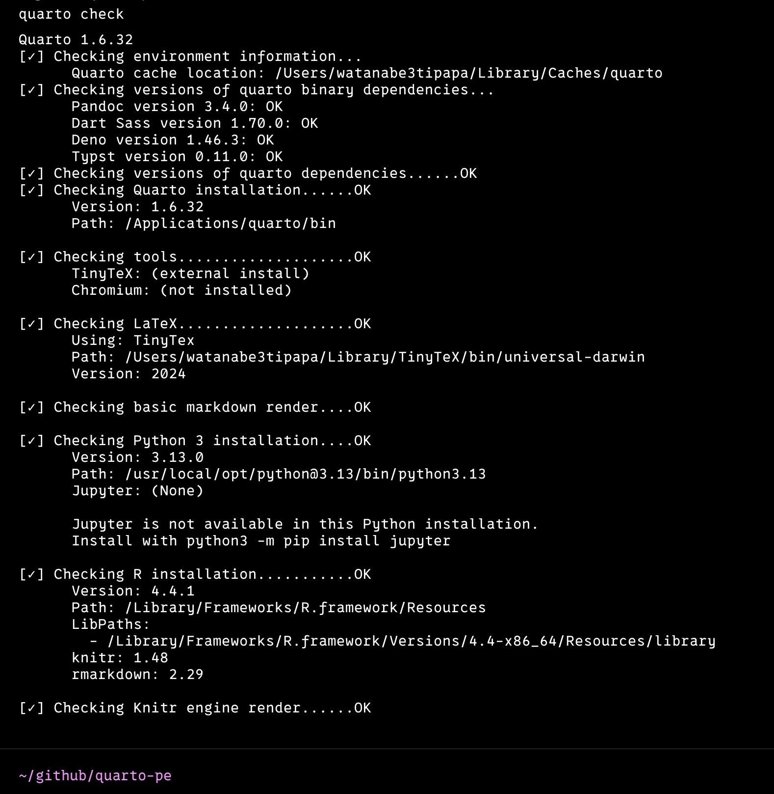

# Q markdown とは？

Quarto は Markdown を拡張した **Q markdown（Quarto Markdown）** を使います。通常の Markdown 構文に加えて、**Div・Callout・相互参照・レイアウト**などの便利な記法が使えます。

::: {.callout-note}
## このページの方針

各記法について「書き方」と「実行結果」をセットで掲載しています。ソースの見方は本文中の `<code>```</code>` ブロックを参照してください。
:::

---

# 基本構文

## 見出し

```markdown
# H1（ページタイトル）
## H2（セクション）
### H3（サブセクション）
#### H4
```

## 強調

```markdown
*イタリック* と **ボールド** と ~~打ち消し~~ と `インラインコード`
```

*イタリック* と **ボールド** と ~~打ち消し~~ と `インラインコード`

## リスト

```markdown
- 順序なしリスト
- 項目2

1. 順序付きリスト
2. 項目2
```

- 順序なしリスト
- 項目2

1. 順序付きリスト
2. 項目2

## リンクと画像

```markdown
[Quarto公式](https://quarto.org/docs/)

{width=300}
```

{fig-alt="Quarto チェック" width=300}

## 引用（ブロッククォート）

```markdown
> 引用文。
> 2行目の引用。
```

> 引用文。
> 2行目の引用。

---

# コード

## フェンスドコードブロック

```markdown
```r
# R のコード
x <- rnorm(100)
mean(x)
```
```

```r
x <- rnorm(100)
mean(x)
```

## 実行可能なコードチャンク

````qmd
```{{r}}
#| fig-cap: "ヒストグラム"
hist(rnorm(100), col = "steelblue")
```
````

### 実行結果

```{r}
#| echo: true
#| fig-cap: "ヒストグラム"
hist(rnorm(100), col = "steelblue")
```

## コードをそのまま表示する

Quarto の構文を**表示用のサンプル**として書きたいときは、コードチャンクの波括弧を二重（<code>{{r}}</code>）にすると実行されずに表示だけされます。

````qmd
```{{r}}
1 + 1
```
````

::: {.callout-tip}
## 二重波括弧の使いどころ

本サイトの各ページにある「テンプレート」コードブロックはすべて二重波括弧（<code>{{r}}</code>）で記述しています。これがないと Quarto がコードチャンクとして実行してしまいます。4つのバッククォートで囲めば、中に3つのバッククォートのコードブロックを含められます。
:::

## インラインコード（動的值）

```{r}
#| include: false
x <- c(1, 2, 3, 4, 5)
```

説明文に <code>r mean(x)</code> のように書くと、実行結果が埋め込まれます。

平均は `r mean(x)`、合計は `r sum(x)` です。

::: {.callout-note}
## 説明文中に書く場合

説明文の中で <code>r 式</code> をそのまま表示したい場合は <code>&lt;code&gt;r 式&lt;/code&gt;</code> の HTML タグを使います。
:::

---

# Div と Callout

## Div（ブロック要素）

`:::` で囲んだブロックにクラスを付与できます。

```markdown
::: {.custom-class}
ここが Div ブロックの中身。
:::
```

## Callout（強調ボックス）

5種類の Callout が使えます。タイトルは `## タイトル` で追加できます。

```markdown
::: {.callout-note}
## メモ
これはノートです。
:::

::: {.callout-warning}
## 注意
これは警告です。
:::

::: {.callout-important}
## 重要
重要な内容です。
:::

::: {.callout-tip}
## ヒント
役立つ情報です。
:::

::: {.callout-caution}
## 注意喚起
注意が必要です。
:::
```

### 実行結果

::: {.callout-note}
## メモ
Callout は `:::` で囲み、`{.callout-種類}` で種類を指定します。タイトルは `## タイトル` で追加できます。
:::

::: {.callout-warning}
## 注意
Callout は入れ子にできません。
:::

::: {.callout-important}
## 重要
PDF 出力でもそのまま反映されます。
:::

::: {.callout-tip}
## ヒント
`appearance: simple` や `collapse: true` などの追加オプションも指定可能です。
:::

::: {.callout-caution}
## 注意喚起
セキュリティ関連の注意事項などを書くのに適しています。
:::

---

# レイアウト

## グリッドレイアウト

```markdown
:::: {.grid}
::: {.g-col-6}
左カラム
:::
::: {.g-col-6}
右カラム
:::
::::
```

## パネルタブセット

```markdown
::: {.panel-tabset}
## R
R のコード例

## Python
Python のコード例
:::
```

### 実行結果

::: {.panel-tabset}
## R
```{r}
hist(rnorm(100), col = "steelblue", main = "R: ヒストグラム")
```
## Python
```python
import matplotlib.pyplot as plt
import numpy as np
plt.hist(np.random.randn(100), color="tomato")
plt.title("Python: ヒストグラム")
plt.show()
```
:::

::: {.callout-note}
## Python チャンクについて

実行可能な `{python}` チャンクには Python 環境（Jupyter）が必要です。本サイトの CI は R のみを用意しているため、Python は表示用のコードブロックとして記載しています。
:::

---

# 相互参照

図・表・数式・節に自動でIDを振り、参照できます。詳細は [\_quarto.yml リファレンス](reference.html) も参照してください。

## 図の参照

````qmd
@fig-hist に分布を示します。

```{r}
#| label: fig-hist
#| fig-cap: "正規乱数の分布"
hist(rnorm(100), col = "steelblue")
```
````

`@fig-dist` にデータの分布を示します。

```{r}
#| label: fig-dist
#| fig-cap: "正規乱数の分布"
x <- rnorm(100)
hist(x, col = "steelblue", breaks = 15)
```

## 表の参照

```markdown
| 統計量 | 値 |
|--------|-----|
| 標本サイズ | <code>r length(x)</code> |
| 平均 | <code>r round(mean(x), 3)</code> |

: 基本統計量一覧 {#tbl-summary}
```

`@tbl-summary` から基本統計量を確認できます。

| 統計量 | 値 |
|--------|-----|
| 標本サイズ | `r length(x)` |
| 平均 | `r round(mean(x), 3)` |
| 標準偏差 | `r round(sd(x), 3)` |

: 基本統計量一覧 {#tbl-summary}

## 参照構文一覧

| 対象 | ラベル | 参照構文 | 表示例 |
|------|--------|----------|--------|
| 図 | `#| label: fig-xxx` | `@fig-xxx` | 図 1 |
| 表 | `{#tbl-xxx}` | `@tbl-xxx` | 表 1 |
| 節 | `{#sec-xxx}` | `@sec-xxx` | 節 2.1 |
| 数式 | `{#eq-xxx}` | `@eq-xxx` | 式 1 |
| コード | `{#lst-xxx}` | `@lst-xxx` | リスト 1 |

---

# 数式

Quarto は Pandoc の数式記法をサポートしています。

## インライン数式

```markdown
アインシュタインの公式は $E = mc^2$ です。
```

アインシュタインの公式は $E = mc^2$ です。

## ブロック数式

```markdown
$$
f(x) = \frac{1}{\sqrt{2\pi\sigma^2}} \exp\left(-\frac{(x-\mu)^2}{2\sigma^2}\right)
$$
```

$$
f(x) = \frac{1}{\sqrt{2\pi\sigma^2}} \exp\left(-\frac{(x-\mu)^2}{2\sigma^2}\right)
$$

数式にはラベルを付けて相互参照できます。

```markdown
$$
E = mc^2
$$ {#eq-relativity}

相対性理論は @eq-relativity で表されます。
```

---

# 変数（shortcodes）

`_quarto.yml` で定義した変数を本文で参照できます。

```yaml
# _quarto.yml
vars:
  author: "watanabe3tipapa"
  year: 2026
```

```markdown
著者: {}（{}）
```

::: {.callout-tip}
## 変数の使いどころ

著者名や連絡先、バージョンなど、**複数ページで使い回す値**を変数化すると更新が1箇所で済みます。
:::

---

# よく使う構文の早見表

| 記法 | 構文 | 備考 |
|------|------|------|
| 見出し | `## H2` | `#` の数でレベル |
| 強調 | `**太字**` | `*斜体*` / `~~打消し~~` |
| インラインコード | `` `code` `` | |
| コードブロック | ```` ```lang ```` | 言語指定可 |
| コードチャンク | ```` ```{r} ```` | 実行される |
| 表示用コード | ```` ```{{r}} ```` | 二重波括弧で表示のみ |
| Callout | `:::{.callout-tip}` | note/warning/important/tip/caution |
| タブセット | `:::{.panel-tabset}` | `##` でタブ |
| グリッド | `:::{.g-col-6}` | 12分割カラム |
| 図参照 | `@fig-xxx` | `#| label: fig-xxx` |
| 表参照 | `@tbl-xxx` | `{#tbl-xxx}` |
| 節参照 | `@sec-xxx` | `{#sec-xxx}` |
| インライン数式 | `$...$` | |
| ブロック数式 | `$$...$$` | |
| 変数参照 | `{}` | `_quarto.yml` の `vars:` |
| 引用 | `> 文` | |
| 水平線 | `---` | |
| 脚注 | `テキスト[^1]` | `[^1]: 脚注内容` |

---

# 参考

- [\_quarto.yml 記法リファレンス](reference.html) — 設定ファイルの体系化リファレンス
- [テンプレート集（コード実行・動的コンテンツ）](content4.html) — コードチャンクの実践例
- [テンプレート集（構造化・多形式）](content5.html) — 相互参照・Callout の実践例
